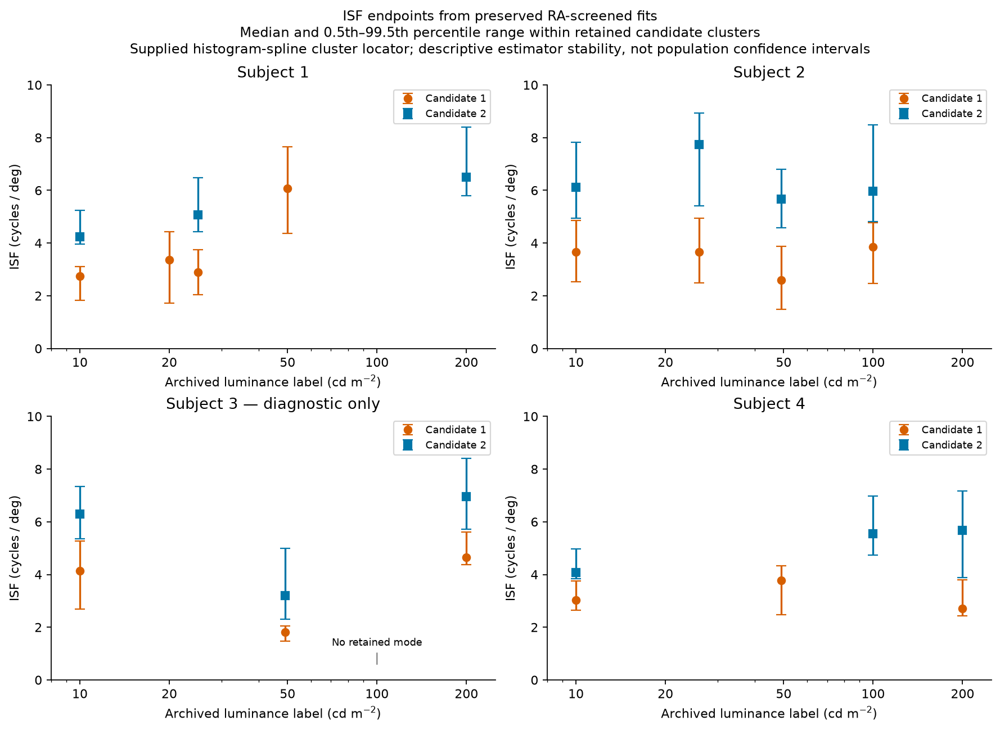

# From raw staircases to ISF error bars

This is the main route through the repository. It focuses on the measurements and saved endpoints; there is no need to begin with the historical fitting-code comparisons.

| Step | Open this | What it shows |
|---|---|---|
| 1. Raw records | `data/raw/trial_files.csv` and `data/raw/source_trials/` | Every selected original numeric trial file, preserved inside gzip |
| 2. Follow each staircase | `data/processed/staircase_trials.csv.gz` | Used trial rows, contrast values, reversal flags and inclusion status |
| 3. See the reversals | `data/processed/staircase_reversals.csv` | Detected reversal contrasts and which are the final five |
| 4. Read the thresholds | `data/processed/staircase_thresholds.csv` | Geometric mean of the final five reversal contrasts for every staircase |
| 5. Compare lateral sensitivity | `data/processed/lateral_profiles_recomputed.csv` | Base/flanker thresholds, sensitivities, natural-log ratios and spreads |
| 6. Read the final ISF summaries | `data/processed/isf_endpoints.csv` | Retained candidate medians, lower/upper percentile endpoints and error-bar lengths |

`condition_summary.csv` gives a quick overview of all 17 conditions and the numbers of included/excluded staircases and retained endpoint modes. All four subjects are present. Subject 3 is marked as diagnostic throughout, consistent with the thesis.

## View the measurements

`figures/measurements/*_staircase_examples.png` shows two recorded staircases at the lowest position in each base/flanker condition, for orientation. Open circles identify detected reversals; orange points identify the final five. The dashed orange line is their geometric-mean threshold. These are deterministic browsing examples, not selected for fit quality. Their inclusion/exclusion status is printed on each panel. The complete tables contain every staircase.

`figures/diagnostics/*_lateral_profiles.png` shows the original deterministic lateral sensitivity calculation independently reconstructed from trials. Its log-ratio error bars follow the supplied plot convention of half the pairwise staircase spread; they are not confidence intervals.

## Exactly what do the ISF points and error bars mean?

Each point is the **median saved RA intrinsic spatial frequency** in a candidate cluster that passes the stated display rule. The lower and upper endpoints are its **0.5th and 99.5th percentiles**, calculated from the original saved fits passing the inclusive RA FMS screen [0.8, 1.0]. `error_minus_cpd` and `error_plus_cpd` give nonnegative distances from the median to these endpoints, ready for an error-bar plot.

These ranges describe within-subject reversal-subset estimator variability, not population confidence intervals. Two retained candidates produce two points at the same luminance. A condition with no retained candidate is recorded explicitly with blank estimates; it is not replaced by zero. Candidate IDs retain their frequency ordering even where only candidate 2 survives.

The table uses the thesis percentile endpoints with the supplied histogram-spline candidate locator. The thesis prose describes a KDE locator, while the supplied helper uses a histogram spline; that difference is disclosed in `KNOWN_LIMITATIONS.md`. The table is therefore a clearly defined summary of preserved fits, not a claim that every endpoint convention in the original figures has been recovered. Both full percentile variants remain in `isf_mode_summaries.csv`.

Luminance labels on this overview follow the archive. More precise thesis values and the unresolved Subject-1 label-20 versus Table-4.2 value-15 difference are kept separately in `config/conditions.json`.

## What is already established?

All deterministic profiles and spreads reproduce exactly. Every nonzero archived input point is compatible with the documented five-of-nine reversal-subset calculation. Accepted-fit counts and primary-subject candidate-cluster counts match the thesis. The original fits and figures are preserved even though the exact historical fitting code and fitted-row-to-input linkage remain unverified.
